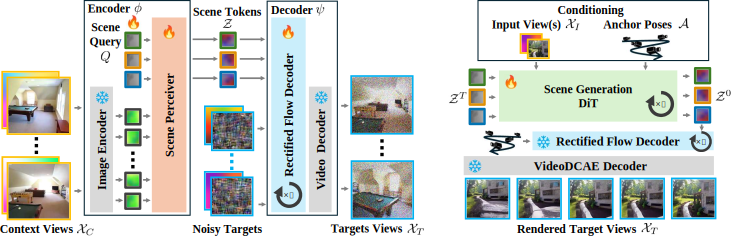

# Full code release soon :)!
# `SceneTok`: A Compressed, Diffusable Token Space for 3D Scenes [CVPR '26] 
<a href="https://mohammadasim98.github.io">Mohammad Asim</a>, <a href="https://geometric-rl.mpi-inf.mpg.de/people/Wewer.html">Christopher Wewer</a>, <a href="https://geometric-rl.mpi-inf.mpg.de/people/lenssen.html">Jan Eric Lenssen</a>

*Max Planck Institute for Informatics, Saarland Informatics Campus*

### `TL;DR: A scene autoencoder that encodes a scene into a compressed, unstructured and diffusable 1D token representation.` 

### 📣 News

- **23.02.2026** - Initial repository releases.
- **21.02.2026** - Accepted to [`CVPR 2026`](https://cvpr.thecvf.com/) 🎉!

## 🔍 Method Overview 

  
  

  
  <b>(Left)</b> `SceneTok` encodes view sets into a set of compressed, unstructured scene tokens by chaining a VA-VAE image compressor and a perceiver module. The tokens can be rendered from novel views with a generative decoder based on rectified flows. 
  
  <b>(Right)</b> `SceneGen` perform scene generation by generating compressed scene tokens conditioned on a single or a few images and a set of anchor poses, defining the spatial scene extent.

## ✅ High-Priority TODOs
`SceneTok` release:
- [ ] RealEstate10K
- [ ] DL3DV

`SceneGen` release:
- [ ] RealEstate10K

## Possible Future Extensions
- [ ] High-resolution SceneTok (512x512)
- [ ] SceneGen (DL3DV)
- [ ] Pointcloud prediction from RGB+Depth renderings

## BibTeX
If you find our work useful in your research, please cite it as:
<section class="section" id="BibTeX">
  

    <pre><code>@inproceedings{asim26scenetok,
    title = {SceneTok: A Compressed, Diffusable Token Space for 3D Scenes},
    author = {Asim, Mohammad and Wewer, Christopher and Lenssen, Jan Eric},
    booktitle = {IEEE/CVF Computer Vision and Pattern Recognition ({CVPR})},
    year = {2026},
}</code></pre>
  

</section>

