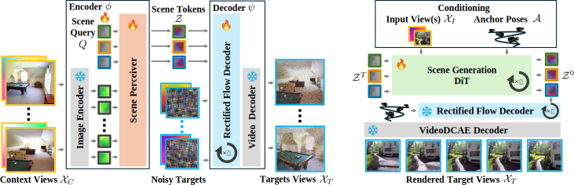

# `SceneTok`: A Compressed, Diffusable Token Space for 3D Scenes [CVPR '26] 
<a href="https://mohammadasim98.github.io">Mohammad Asim</a>, <a href="https://geometric-rl.mpi-inf.mpg.de/people/Wewer.html">Christopher Wewer</a>, <a href="https://geometric-rl.mpi-inf.mpg.de/people/lenssen.html">Jan Eric Lenssen</a>

*Max Planck Institute for Informatics, Saarland Informatics Campus*

[](https://geometric-rl.mpi-inf.mpg.de/scenetok/) [](https://arxiv.org/abs/2602.18882)


### `TL;DR: A scene autoencoder that encodes a scene into a compressed, unstructured and diffusable 1D token representation.` 

### 📣 News

- **09.03.2026** - `SceneTok` Code, documentation and checkpoint release
- **23.02.2026** - Initial repository release
- **21.02.2026** - Accepted to [`CVPR 2026`](https://cvpr.thecvf.com/) 🎉!

## 🔍 Method Overview 
<div align="center">
  
  
</div>
<div align="justify">
<p>
  
  <b>(Left)</b> `SceneTok` encodes view sets into a set of compressed, unstructured scene tokens by chaining a VA-VAE image compressor and a perceiver module. The tokens can be rendered from novel views with a generative decoder based on rectified flows. 
  
  <b>(Right)</b> `SceneGen` perform scene generation by generating compressed scene tokens conditioned on a single or a few images and a set of anchor poses, defining the spatial scene extent.
</p>
</div>


## Installation
### System Requirements
```bash
CUDA >= 11.8
Python >= 3.9
PyTorch >= 2.5
```
> [!NOTE]
> We only tested on the following so far: 
> `torch 2.5.1`, `Python 3.11`, `CUDA 12.1`
<details>
  <summary>Hardware Requirements</summary>

Tested hardware for inference:

| GPU | Mem 
|-----------|-----------|
| L40S | 45GB |
| Quadro RTX 8000 | 48GB |
| RTX 4090 | 24GB |

Test hardware for training:

| GPU | Mem 
|-----------|-----------|
| A100 | 40GB/80GB |
| H100 | 96GB |

</details>
<details>
  <summary>Setting Up Environment</summary>
Clone the repository

```bash
git clone https://github.com/mohammadasim98/scenetok.git --recursive
cd scenetok
```

You use any environment manager, we show an example for `conda`
```bash

conda create -n scenetok -python=3.11
conda activate scenetok

# torch 2.5.1 + cuda 12.1
pip install torch==2.5.1 torchvision==0.20.1 torchaudio==2.5.1 --index-url https://download.pytorch.org/whl/cu121

```


Install remaining dependencies.
```bash
pip install -r requirements.txt
```

We use `Flash Attention 2` in our project, refer to their repository for more details regarding installation.

```bash
pip install psutils ninja packaging
pip install flash-attn --no-build-isolation
```

</details>
<details>
  <summary>Downloading Data</summary>

> #### **Datasets**
> Place the dataset in `dataset/` folder.
> Refer to [DATASET.md](/docs/DATASET.md) for more information into downloading and preprocessing the datasets. 


> #### **Models**
> Download the models to `checkpoints/` folder.
> | Dataset | Model | rFID 
> |-----------|-----------|-----------|
> | RealEstate10K | [va-videodc_re10k](https://nextcloud.mpi-klsb.mpg.de/index.php/s/6Y7EsosfbnpcRxj)   | 11.12   |
> | DL3DV | [va-videodc_dl3dv](https://nextcloud.mpi-klsb.mpg.de/index.php/s/aYBX7atFNKkmdSE)   | 19.12   |
> | | [va-wan_dl3dv](https://nextcloud.mpi-klsb.mpg.de/index.php/s/X7yzk7QANtwawPc)   | **14.30**   |

> #### **Pretrained AEs**
> 
> Download [VA-VAE](https://huggingface.co/hustvl/vavae-imagenet256-f16d32-dinov2/blob/main/vavae-imagenet256-f16d32-dinov2.pt) including the [latent statistics](https://huggingface.co/hustvl/vavae-imagenet256-f16d32-dinov2/blob/main/latents_stats.pt) to `checkpoints/` folder.
> 
> Download [VideoDCAE](https://huggingface.co/hpcai-tech/Open-Sora-v2-Video-DC-AE/resolve/main/F32T4C128_AE.safetensors) to `checkpoint/` folder.
>
> Download [Wan 2.2 VAE](https://huggingface.co/Wan-AI/Wan2.2-TI2V-5B/resolve/main/Wan2.2_VAE.pth) to `checkpoint/` folder.

</details>

> [!NOTE]
> If you are using other environments than `conda`, then modify the environmental setup in `scripts/*sh`.

## Inference on Notebook

We provide with helper notebooks to perform quick inference with [SceneTok](/notebook/scenetok.ipynb) and [SceneGen](/notebook/scenegen.ipynb). 

## Training SceneTok
Run the following to initiate training:
```bash
python -m src.main +experiment=${config} \
  data_loader.train.num_workers=${num_workers} \
  mode=train \
  trainer.devices=${gpus} \
  trainer.num_nodes=${num_nodes} \
  wandb.activated=true
```
> [!IMPORTANT]
> In case of memory issues (OOM), you can reduce the overal memory consumption by setting `gradient_checkpointing=true` for `model.denoiser` and `model.compressor` in `config/experiments/*.yaml`. They are set to `false`  by default.

Set the parameters according to your needs. We provide the following configurations files `${config}` for `SceneTok`. Note that you can modifiy/add your own configurations. The configuration for DL3DV finetunes pretrained weights from RealEstate10K, but you can train from scratch as well.
```bash
# RealEstate10
scenetok_va-vdc_lognorm_re10k_scratch

# DL3DV (VA-VAE + VideoDCAE)
scenetok_va-vdc_shift4_dl3dv_finetuned
scenetok_va-vdc_shift8_dl3dv_finetuned

# DL3DV (VA-VAE + Wan)
scenetok_va-wan_shift4_dl3dv_finetuned
scenetok_va-wan_shift8_dl3dv_finetuned
```
<details>
  <summary>Using SLURM</summary>

  We provide SLURM script to allow multi-node/gpu training using job arrays. In `scripts/slurm_job_array_scenetok.sh` we provide a template where you can define your own configuration related to GPU and job array configurations. 
  First, set the `PROJECT_ROOT` as environment variable:
  ```bash
  export PROJECT_ROOT="<your-project-directory>"
  ```
  The simply run it as:

  ```bash
  bash slurm_job_array_scenetok.sh ${config}
  ```  
</details>


## Inference on SceneTok

```bash
python -m src.main +experiment=${config} mode=test hydra.job.name=test \
  dataset=re10k \
  wandb.activated=false \ 
  trainer.limit_test_batches=1 \
  data_loader.test.batch_size=1 \
  model.compressor.ckpt_path=${ckpt} \
  model.denoiser.ckpt_path=${ckpt} \
  dataset.root=${data_root} \
  test.output_dir=${output_dir} \
  dataset.view_sampler.index_path=${index_path}
```
> [!NOTE]
> `model.compressor` and `model.denoiser` uses the same checkpoint file

List below are the `config` with checkpoints weights provided [here](#models)
```bash
# RealEstate10
scenetok_va-vdc_lognorm_re10k_scratch # va-videodc_re10k.ckpt

# DL3DV (VA-VAE + VideoDCAE)
scenetok_va-vdc_shift8_dl3dv_finetuned # va-videodc_dl3dv.ckpt

# DL3DV (VA-VAE + Wan)
scenetok_va-wan_shift4_dl3dv_finetuned # va-wan_dl3dv.ckpt
```
`index_path` are view indices to use for context and targets. We provide several index files in `assets/evaluation_index/`


## ✅ TODO
`SceneTok`
- [x] RealEstate10K - VA-VAE+VideoDC
- [x] DL3DV - VA-VAE+Wan
- [x] DL3DV - VA-VAE+VideoDC

`SceneGen` (Soon)
- [ ] RealEstate10K - VA-VAE+VideoDC

## Possible Future Extensions
- [ ] High-resolution SceneTok (512x512)
- [ ] SceneGen (DL3DV)
- [ ] Pointcloud prediction from RGB+Depth renderings


## BibTeX
If you find our work useful in your research, please cite it as:
<section class="section" id="BibTeX">
  <div class="container is-max-desktop content">
    <pre><code>@inproceedings{asim26scenetok,
    title = {SceneTok: A Compressed, Diffusable Token Space for 3D Scenes},
    author = {Asim, Mohammad and Wewer, Christopher and Lenssen, Jan Eric},
    booktitle = {IEEE/CVF Computer Vision and Pattern Recognition ({CVPR})},
    year = {2026},
}</code></pre>
  </div>
</section>


